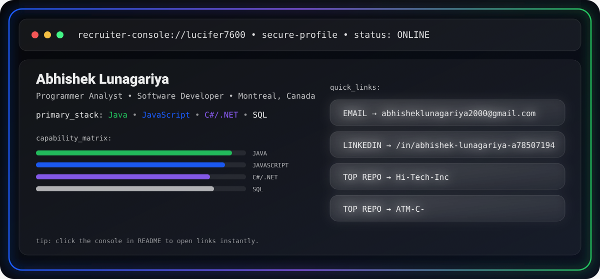
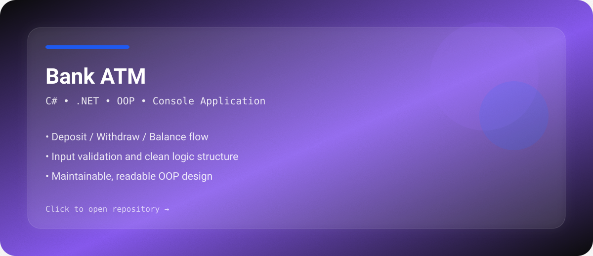

<!-- =====================================================
     GitHub Profile README
     Abhishek Lunagariya (Lucifer7600)
     Style: Luxury • Custom Animated SVG Hero + Glass Cards
===================================================== -->

  

  

  
  
  

  

  
  
  
  

  

---

## 👋 About Me
I’m a **Programmer Analyst / Software Developer** based in **Montreal, Canada**, with hands-on experience in **Java**, **JavaScript**, **C#**, **.NET**, and **SQL Server**.

I work close to real systems — analyzing requirements, fixing bugs, improving performance, and writing clean, maintainable code.

---

## 🚀 Featured Projects (Luxury Glass Cards)

<table>
<tr>
<td width="50%" valign="top">
  
</td>
<td width="50%" valign="top">
  
</td>
</tr>
<tr>
<td width="50%" valign="top">
  
</td>
<td width="50%" valign="top">
  
</td>
</tr>
</table>

---

## 🛠️ Tech Stack

  

---

## 📊 GitHub Stats
<!--START_SECTION:waka-->

  
  

  

<!--END_SECTION:waka-->
---

## 🐍 Contribution Snake

  

---

## 🤝 Let’s Connect
📧 Email: **abhisheklunagariya2000@gmail.com**  
🔗 LinkedIn: **linkedin.com/in/abhishek-lunagariya-a78507194**

