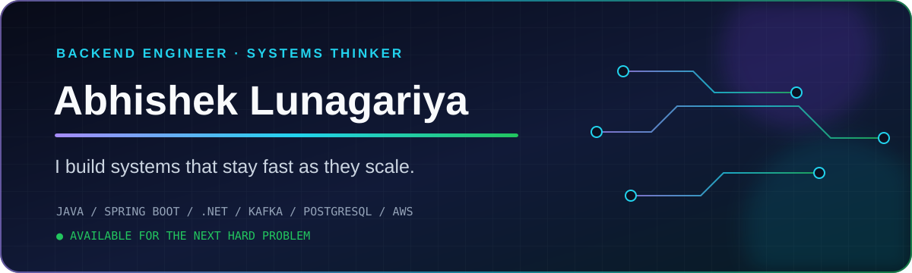
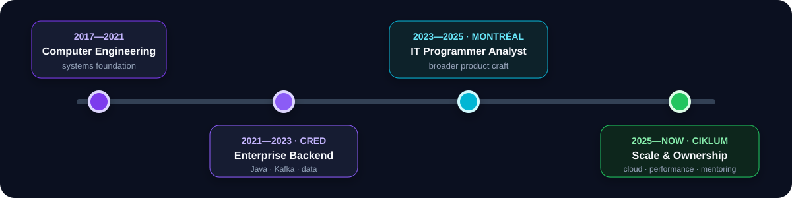
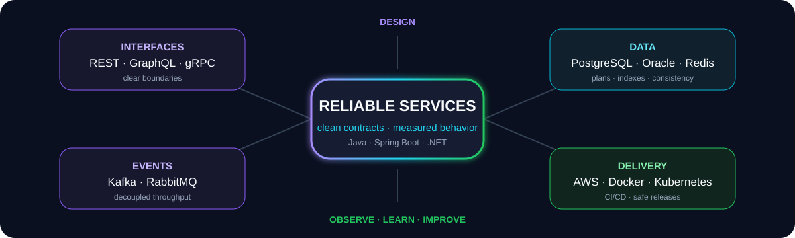

<!--
  GitHub profile README for github.com/Lucifer7600
  Install: create/use the public repository `Lucifer7600`, then copy this file
  and the `assets/` folder to its default branch.
-->

<p align="center">
  
</p>

<p align="center">
  <a href="mailto:Abhyluna2000@gmail.com"></a>
  <a href="https://www.linkedin.com/in/abhishek-lunagariya-a78507194"></a>
  <a href="https://github.com/Lucifer7600?tab=repositories"></a>
</p>

<p align="center">
  <code>Java</code> · <code>Spring Boot</code> · <code>.NET</code> · <code>PostgreSQL</code> · <code>Kafka</code> · <code>AWS</code> · <code>Docker</code> · <code>Kubernetes</code>
</p>

## I turn backend pressure into measurable performance.

I’m **Abhishek Lunagariya**, a software developer in Canada with **4+ years of experience** building enterprise backends, distributed workflows, and cloud-ready products. I work where application logic, data, and delivery meet—designing clean APIs, finding performance bottlenecks, and carrying changes safely into production.

<table>
  <tr>
    <td align="center"><strong>20+</strong><br/><sub>REST APIs delivered</sub></td>
    <td align="center"><strong>20,000+</strong><br/><sub>concurrent requests supported</sub></td>
    <td align="center"><strong>30%</strong><br/><sub>database throughput gain</sub></td>
    <td align="center"><strong>95%</strong><br/><sub>test coverage achieved</sub></td>
  </tr>
</table>

> **My engineering signature:** measure first → isolate the bottleneck → simplify the path → automate the proof.

## The journey so far

<p align="center">
  
</p>

<details>
<summary><strong>Open the impact log</strong></summary>

### Ciklum · Software Developer · 2025—present

- Build Java/Spring Boot microservices for a compliance platform serving **10,000+ active users**.
- Cut API latency from **500 ms → 400 ms** through query, indexing, pagination, and service-layer improvements.
- Increased PostgreSQL read/write throughput by **30%** and integrated secure AWS S3 report storage.
- Reduced manual deployment effort by **40%** with Docker, Jenkins, and GitHub Actions.
- Review code, support production releases, and mentor junior developers.

### CRED · Software Developer · 2021—2023

- Built inventory and compliance services processing **15,000+ daily transactions** at **<1% error rate**.
- Refactored legacy Java/JPA flows from **250 ms → 180 ms** processing time.
- Introduced Kafka-based asynchronous pipelines, increasing throughput by **20%**.
- Reached **95% test coverage** with JUnit and Mockito and reduced production defects by **18%**.
- Optimized PostgreSQL/Oracle reporting workloads, reducing report generation time by **35%**.

</details>

## How I think about a system

<p align="center">
  
</p>

| I design | I optimize | I operate |
|:--|:--|:--|
| REST/GraphQL APIs, service boundaries, domain logic | SQL plans, indexes, latency, throughput | CI/CD, containers, release quality, production issues |
| Spring Boot, Hibernate/JPA, ASP.NET Core | PostgreSQL, Oracle, Redis, Elasticsearch | AWS, Docker, Kubernetes, Jenkins, GitHub Actions |
| Kafka/RabbitMQ workflows and integrations | caching, pagination, async processing | tests, API contracts, logs, metrics, incident diagnosis |

## What happens when a system slows down?

I don’t begin with a rewrite. I begin with evidence.

```text
  01 · REPRODUCE          02 · TRACE               03 · CHANGE              04 · PROVE
  Capture the real   →    Follow latency across →  Remove the actual    →   Load-test, compare,
  workload and impact     app, data, and network    constraint—not noise     deploy, and observe
```

That loop helped me find repeated database calls and a missing composite index in a high-traffic compliance endpoint. The result was not just “faster code”—it was a measured improvement from **500 ms to 400 ms**, lower database pressure, and better performance for other endpoints sharing the same data path.

### My developer operating system

<table>
  <tr>
    <td width="33%" valign="top">
      <strong>🧭 Think in systems</strong><br/><br/>
      A slow API may be a query, connection pool, network dependency, mapper, or contract problem. I trace the whole path before choosing the fix.
    </td>
    <td width="33%" valign="top">
      <strong>🛡️ Ship with evidence</strong><br/><br/>
      Tests, execution plans, realistic datasets, API contracts, and post-release metrics turn an implementation into a dependable production change.
    </td>
    <td width="33%" valign="top">
      <strong>🤝 Own the outcome</strong><br/><br/>
      I work from requirement clarification through design, delivery, deployment, troubleshooting, and knowledge-sharing—not only until the code compiles.
    </td>
  </tr>
</table>

> I’m at my best where **backend engineering**, **data performance**, and **production ownership** overlap.

## Capability constellation

```text
                         DISTRIBUTED SYSTEMS
                    Kafka · RabbitMQ · gRPC
                              ▲
                              │
  PRODUCT ◄──── React · Next.js ── API DESIGN ── Spring Boot · ASP.NET ────► CLOUD
                              │                         AWS · Docker · K8s
                              ▼
                       DATA & PERFORMANCE
              PostgreSQL · Oracle · Redis · SQL tuning
```

<p align="center">
  
  
</p>

## What I’m growing next

`deeper distributed-system design` · `observability` · `Kubernetes` · `cloud architecture` · `production ownership`

I’m interested in **intermediate backend / software engineering opportunities** where performance, reliability, and thoughtful system design matter. If you’re building a product that needs clean services and calm production ownership, let’s talk.

<p align="center">
  <a href="mailto:Abhyluna2000@gmail.com"><strong>Start a conversation</strong></a>
  &nbsp;·&nbsp;
  <a href="https://www.linkedin.com/in/abhishek-lunagariya-a78507194">LinkedIn</a>
  &nbsp;·&nbsp;
  <a href="https://github.com/Lucifer7600?tab=repositories">All repositories</a>
</p>

<p align="center"><sub>Build clearly. Measure honestly. Improve continuously.</sub></p>
